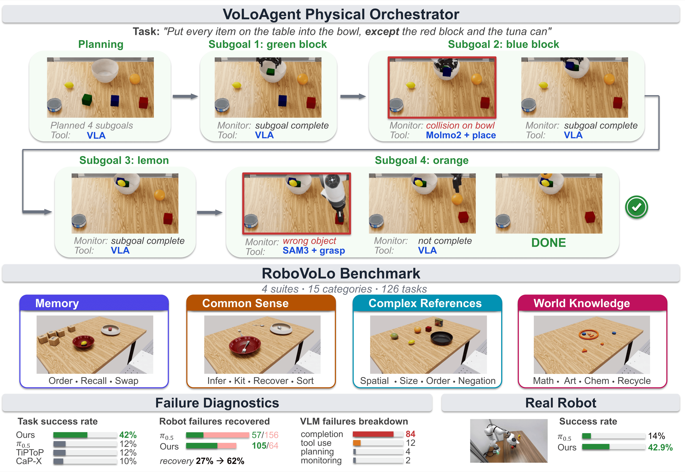
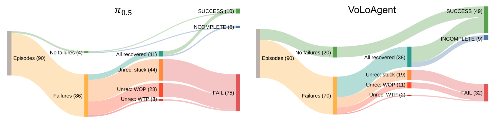
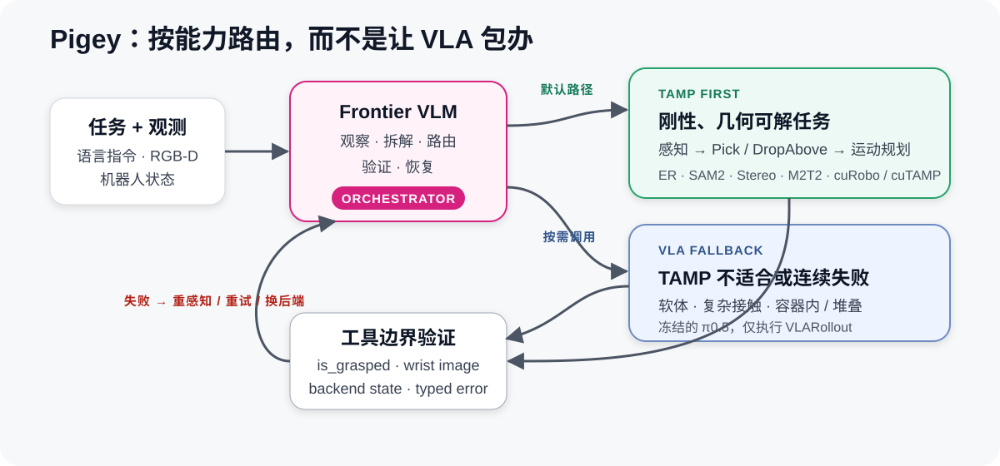

# Robot Agent 调研

## 1. VoLoAgent

> [项目主页](https://chicychen.github.io/VoLo/) · [论文](https://arxiv.org/abs/2606.07723) · [代码](https://github.com/NVlabs/VoLoAgent)

- **核心**：把 VLA 作为可中断工具，与感知、抓取、放置原语并列；VLM 负责规划、低频监控和恢复，发现偏离后执行 monitor → halt → redirect。
- **关键设计**：动作与监控异步；监控使用短上下文，规划才读完整上下文；推理期间机械臂保持安全静止。
- **结果**：RoboVoLo 总成功率从纯 π0.5 的 12.57% 提升到 41.80%；失败恢复率从 13% 提升到 54%；真机为 42.9% vs. 14.3%。
- **主要问题**：completion monitor 是最大错误源；云端 VLM 单次约 1–5 秒，无法承担高频物理状态检查。

  
   
  图 1：VoLoAgent 的规划、监控、工具切换与评测。

  
   
  图 2：VoLoAgent 将失败恢复率从 13% 提升到 54%。

## 2. Pigey

> [项目主页](https://lianegalanti.github.io/Pigey/) · [论文](https://arxiv.org/abs/2607.21725) · [代码](https://github.com/lianegalanti/Pigey)

- **核心**：直接切掉 VLA 不擅长的任务，默认优先使用 TAMP。刚性、目标明确、几何可解的抓取/放置不让 VLA 尝试；软体、复杂接触、容器内/堆叠物体或 TAMP 连续失败时才调用 π0.5。
- **工具链**：VLM 只做观察、拆解、路由和恢复；Pick/DropAbove 走 Gemini Robotics-ER → SAM2 → FoundationStereo → M2T2 → cuRobo/cuTAMP；VLARollout 才使用冻结的 π0.5。
- **验证**：工具边界检查 backend 状态、is_grasped 和 wrist image；抓取未验证就禁止放置；失败后重新感知、重试或切换后端。
- **结果**：六个选定 LIBERO-PRO suites 为 53.3% vs. π0.5 12.8%；真机 30 个 capability probes 为 97.3% vs. 16.7%。
- **解读**：提升来自新增 TAMP、感知、验证和路由，而不是 VLA 本身变强；每次真机任务需 3–15 次 VLM 调用、约 2–6 分钟。

  
   
  图 3：默认优先 TAMP；VLA 只处理 TAMP 不适合或连续失败的任务。

## 3. RoboBRIDGE

> [论文](https://arxiv.org/abs/2607.27881)

- **核心**：把 Perceptor、Planner、Controller、Monitor、Robot Interface 拆成不同速率的并发模块；执行不等待感知和大模型，避免“走一步、停下来想一步”。
- **边走边想**：Controller 持续执行当前 action chunk，Perceptor 后台刷新只保留最新状态的 buffer；下一段推理与当前动作重叠，新结果在安全边界接管，异常则立即 halt。
- **按需重算**：仅当最新场景相对计划的位姿变化、物体增删超过阈值才重新参数化或 replan；失败后按 `retry → regenerate → replan → re-perceive` 选择最小恢复范围。
- **两速监控**：约 5 Hz 的轻量检测器在 control loop 外运行，不阻塞控制；只有高置信失败才停止机器人并调用慢速诊断模型。
- **效果**：同一 controller 加入整套编排后，LIBERO 35.5% → 39.7%，RoboCasa 3.7% → 7.5%；论文未单独消融异步感知，不能把全部增益归因于异步。
- **边界**：场景漂移主要在 primitive 结束后检查；执行中突变仍依赖 Monitor 触发中断。

**Runtime 要点：控制循环永不等待模型；执行当前 chunk 时并行计算下一 chunk，只消费最新观测，并在可中断的安全边界切换。**

## 4. Verifier 设计

### 4.1 原则

- **Verifier 不应等于 VLM**：低层状态优先使用传感器、规则、几何和专用模型；只有语义问题才升级到 VLM。
- **事件触发优先于固定轮询**：先用便宜信号判断“是否值得验证”，再调用对应 verifier。
- **验证频率不等于控制频率**：控制与安全高频运行，物理状态中频检查，语义验证低频或只在 skill boundary 触发。

### 4.2 三层结构

| 层级 | 验证内容 | 机制 | 触发方式 |
| --- | --- | --- | --- |
| L0 Safety / Control | 关节限位、碰撞、力、速度、控制器错误 | ROS/传感器/硬规则 | 持续高频 |
| L1 Physical State | 是否抓住、EE 是否卡住、物体是否随手移动、轨迹是否偏离 | proprioception、gripper FSM、point tracking、几何或小模型 | 事件触发或中频 |
| L2 Semantic State | 是否抓对、是否放到正确位置、子目标/总任务是否完成 | 小型语义 head、scene graph、VLM | skill boundary、异常或不确定时 |

### 4.3 什么时候触发

| 事件 | 应触发的验证 |
| --- | --- |
| gripper close / load stable | 抓取验证：夹爪负载 + 物体是否随夹爪上升 |
| gripper release | 放置验证：目标物体与目标区域的关系 |
| EE 长时间无进展 | stuck / obstruction 检查 |
| 力突增、轨迹偏差、控制器报错 | 立即进入安全检查，必要时中断 |
| action chunk / skill 结束 | 执行结果和进度检查 |
| subgoal 完成或准备 Done | 使用最新观测做语义验证 |
| 多个信号冲突或低置信度 | 升级到 VLM；允许返回 unknown 并重新观察 |

### 4.4 频率建议

- **L0**：跟随控制/状态回路，通常 100–500 Hz；
- **L1**：约 10–50 Hz，或由夹爪、接触、停滞、轨迹偏差等事件触发；
- **L2**：约 0.2–2 Hz，或仅在 action chunk、skill、subgoal 边界触发；
- 上述数值是架构量级示例，实际频率由机器人动力学、停止距离和模型延迟决定。

### 4.5 判定规则

- 工具返回 success 不等于任务完成，必须有外部证据；
- 任务状态和 memory 只在验证通过后更新；
- 抓取未验证，不允许进入 transport/place；
- Done 前必须使用新观测验证最终谓词；
- verifier 应输出 success / failure / unknown、置信度、证据和时间戳；
- VLM 不作为安全层或唯一 verifier。

### 4.6 相关实现

| 项目 | Verifier 做法 |
| --- | --- |
| [AGM](https://arxiv.org/abs/2608.29537) | gripper FSM 决定何时验证；CoTracker3 验证抓取；SigLIP + 2.43M head 验证放置；部署时无需在线自回归 VLM |
| [CodeGraphVLP](https://arxiv.org/abs/2604.22238) | semantic graph + executable planner 做进度检查，避免每步调用 VLM |
| VoLoAgent | 低频 VLM monitor；也可用 EE/action signal 先触发，再做视觉确认 |
| Pigey | tool boundary 使用传感器、typed error 和 wrist image 验证 |
| RoboBRIDGE | control loop 外约 5 Hz 轻量检测；失败后才调用慢速诊断并选择最小恢复范围 |
| [CheckVLA](https://arxiv.org/abs/2607.26789) | action-conditioned world model 在 action chunk 执行中比较预期与实际状态，并按推理延迟重写可修改的动作后缀 |

**结论：能用 sensor 判断的不用 vision，能用专用视觉模型判断的不用 VLM；VLM 只处理真正需要语义理解或多证据仲裁的情况。**
